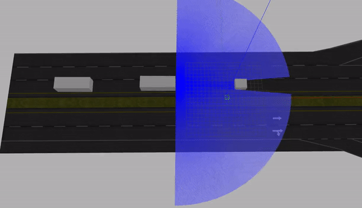

# Master Thesis Simulation
##### ROS Package - Simulation Environment
Repository containing a simulation environment as part of a Dissertation submitted in partial partial fulfilment for the degree of Master of Science in Electrical and Computer Engineering at [Instituto Superior Técnico - Lisbon University](https://tecnico.ulisboa.pt/pt/).




## Overview

The goal of this simulation environment is to evaluate the proposed approach for truck platooning using a Nonlinear Model Predictive Control (MPC) strategy within a Cooperative Adaptive Cruise Control (CACC) framework. The approach's performance is tested in various scenarios, including obstacle avoidance, lane-changing maneuvers, overtaking, and abrupt braking for the ego vehicle within a platoon.


#### Keywords
Nonlinear Model Predictive Control (NMPC), Cooperative Adaptive Cruise Control (CACC), Obstacle avoidance

## Contents & Usage

- **launch**: Contains launch files for starting the simulation environment.
   - `world.launch`: Launches the simulation highway environment.
      ```bash
      roslaunch my_truckie world.launch
      ```
   - `platoon.launch`: Launches the simulation environment for basic lane-changing maneuvers within a platoon.
      ```bash
      roslaunch my_truckie platoon.launch init_y:="-9.5" init_z:="0"
      ```
   - `static_obstacle.launch`: Initiates the simulation environment for static obstacle avoidance scenarios.
      ```bash
      roslaunch my_truckie static_obstacle.launch
      ```
   - `dynamic_obstacle.launch`: Sets up the simulation environment for overtaking scenarios involving dynamic obstacles.
      ```bash
      roslaunch my_truckie dynamic_obstacle.launch
      ```
   - `braking.launch`: Launches the simulation environment to evaluate the ego vehicle's response to abrupt braking scenarios.
      ```bash
      roslaunch my_truckie platoon.launch init_y:="-9.5" init_z:="0"
      ```
   - `rviz.launch`: Launches the RViz visualization tool for real-time visualization of the simulation environment.
      ```bash
      roslaunch my_truckie rviz.launch
      ```
- **config**: Configuration files for setting up simulation parameters and vehicle properties.
- **scr**: Python scripts implementing the proposed control approach and scenario setups.
- **worlds**: Gazebo world files representing different road and traffic scenarios.
- **rviz**: RViz configuration files for visualizing the simulation environment.
- **urdf**: Contains files related to the Unified Robot Description Format (URDF) used to describe the vehicle models for simulation.
- **results**: Contains video simulations of experiments and demonstrations showcasing the performance of the proposed approach in various scenarios.


_Note: The package name "my_truckie" was used during the development._


## Installation

1. Clone this repository into your ROS workspace:

   ```bash
   git clone https://github.com/blourenco217/master-thesis-simulation.git
   ```

2. Build the ROS package:
   ```bash
   cd ~/your-ros-workspace
   catkin_make
   ```

For questions or inquiries, please contact blourenco217@gmail.com.

## Contributions & Acknowledgments

This simulation environment has been developed as part of a Master's thesis project at [Instituto Superior Técnico - Lisbon University](https://tecnico.ulisboa.pt/pt/). I would like to acknowledge the support and guidance received from the thesis supervisor, Daniel Silvestre, and express my gratitude to the academic community and fellow researchers who contributed to the successful completion of this project.